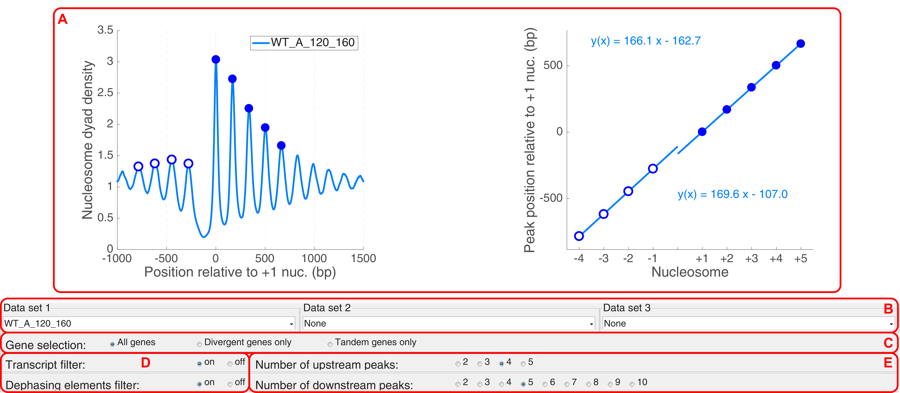

This is a graphical user interface (GUI) that was used in the Clark lab to compare the global nucleosome spacing (a.k.a. nucleosome repeat length) in wild type and mutant yeast cells.
To start the GUI, run `Regression_Analysis_GUI.m`

The GUI contains the following panels:

||
|:--:| 
| **(A)** - plotting panel that displays the average nucleosome dyad distributions; **(B)** - selection panel that allows user to load up to three different data sets corresponding to different replicates from wild type or mutant cells; **(C)** - radio button selection panel that allows the user to select whether the plots should contain the average distributions for all gene promoters, the promoters of only the divergent genes, or the promoters of the downstream genes from tandem gene pairs; **(D)** - radio button selection panel that allows the user to select whether to mask (eliminate from averaging, when the filter is on) the regions downstream of the transcript end (for the cases when the transcripts are shorter than 1.5 kb), or to eliminate the genes that contain "nucleosome dephasing elements", i.e. origins of replication, LTR retrotransposons, centromeres, long terminal repeats, snRNAs, snoRNAs, tRNAs; **(E)** - selection panel for the number of peaks that should be used in the linear regression. |
